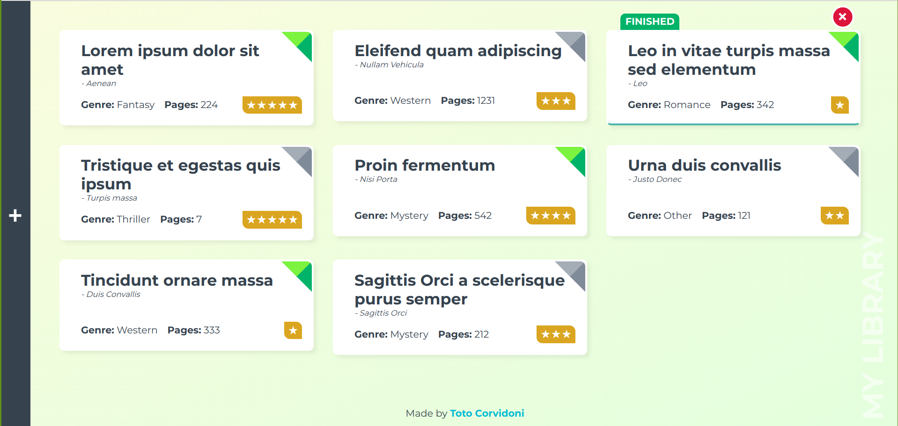

myLibrary
=========

This was made as an exercise for the [Odin Project](https://www.theodinproject.com/courses/javascript/lessons/library).

You can see a working version of this app [here](https://totocorvidoni.github.io/myLibrary/).

It's a simple virtual library where you can keep track of all of your books, you can even mark them as read once you have finish a book by clicking on their entries.
The books you add will be saved on the browser's local storage so as long as the environment is the same and no storage gets cleaned your library will persist.

It has a strong emphasis on visuals since the exercise was about learning to use a front-end framework, [Vue.js](https://vuejs.org/) in my case.

## Pending Features

- Have real user accounts and persistance via back-end support.
- "Where I left off?" tracking for individual books.
- Edit a book.
- Book sorting.
- Multiple libraries.

I hope you like it and let me know if you have any thoughts.